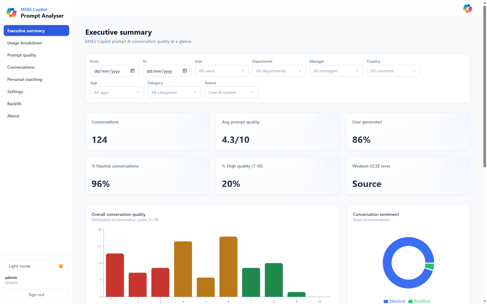
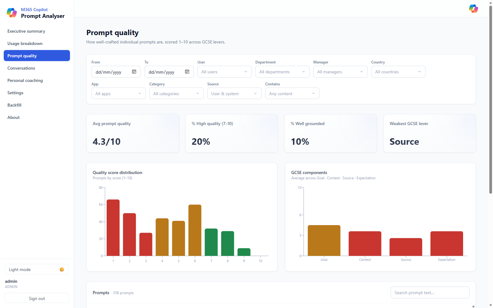
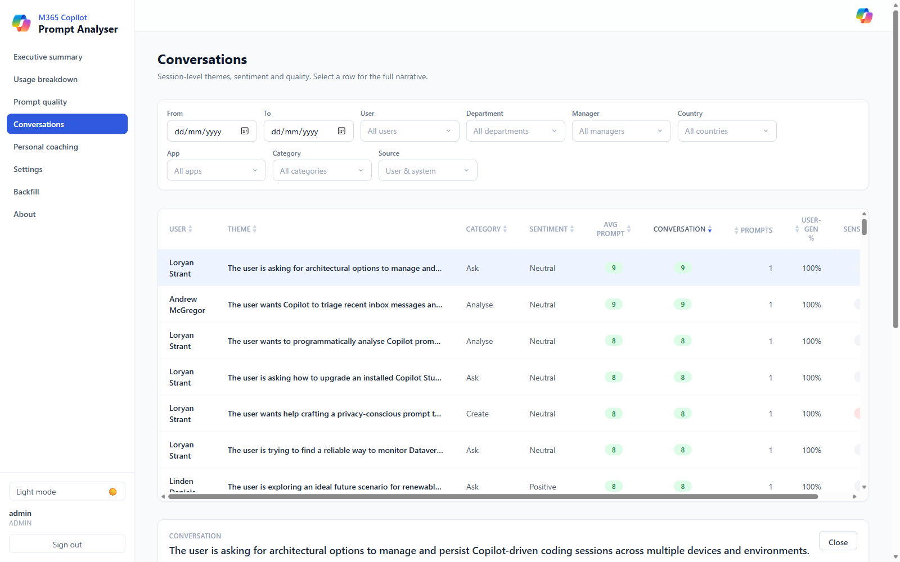
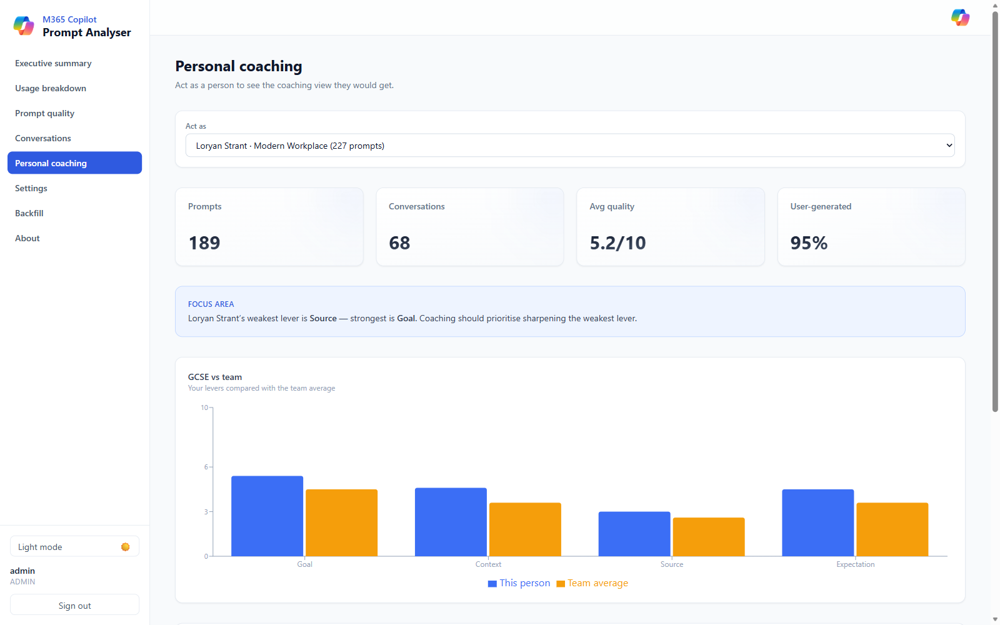
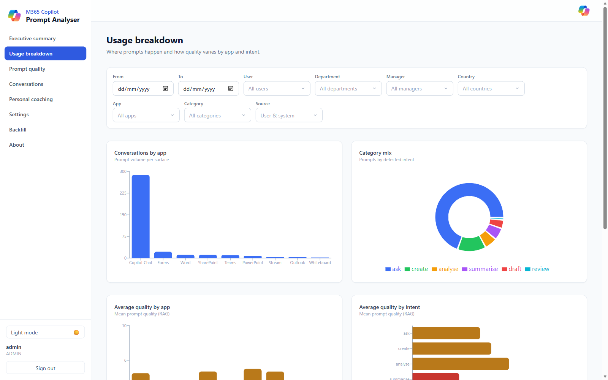
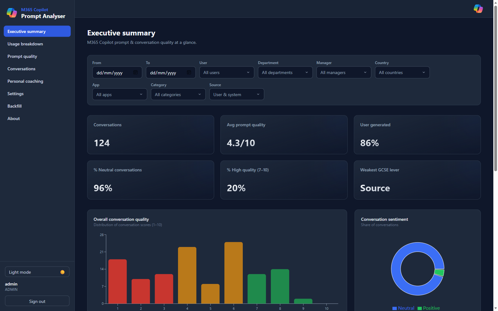

# M365 Copilot Prompt Analyser

Self-hosted prompt-quality reporting for **Microsoft 365 Copilot**. It ingests prompts from
Microsoft Graph, sends each conversation to Azure OpenAI for quality, GCSE, sentiment and
category scoring plus sensitive-information detection, stores the results in PostgreSQL, and
serves a web dashboard. A replacement for the Power Platform + Power BI version — no Power BI
licence, no Power Platform, and no data leaves your subscription. Runs anywhere with
`docker compose up`, or deploys to Azure Container Apps in one click.

[](https://portal.azure.com/#create/Microsoft.Template/uri/https%3A%2F%2Fraw.githubusercontent.com%2Floryanstrant%2FM365Copilot-Prompt-Analyser%2Fmain%2Finfra%2Fazuredeploy.json/createUIDefinitionUri/https%3A%2F%2Fraw.githubusercontent.com%2Floryanstrant%2FM365Copilot-Prompt-Analyser%2Fmain%2Finfra%2FcreateUiDefinition.json)

> Community project, MIT-licensed. Not covered by a Microsoft support agreement.
## Screenshots

### Executive summary
At-a-glance KPIs (conversations, average prompt quality, user-generated share,
sentiment, high-quality rate, weakest GCSE lever) plus the conversation-quality
distribution and sentiment mix.



### Prompt quality
Per-prompt scoring (1–10) across the four GCSE levers, the quality distribution,
and a searchable, sortable table with per-prompt sentiment, source and the
name / sensitive-info / profanity governance signals.



### Conversations
Session-level themes, sentiment and both the **average-of-prompts** and holistic
**conversation** score. Selecting a conversation opens the full narrative
(insight, theme, suggested improvement, suggested starter prompt) and the ordered
prompt thread with each prompt's scores.



### Personal coaching
"Act as" any user to see the coaching view they'd get — their KPIs, a focus-area
callout, GCSE-vs-team comparison, and their conversations.



### Usage breakdown & dark mode
Per-app and per-intent volume and average quality, category mix, and GCSE-by-intent.
Every page supports a light and dark theme.





## Deploy to Azure (one click)

The button provisions everything into a resource group of your choice: a PostgreSQL
flexible server, a Container Apps environment, and the **api** + **worker** container
apps (pulled as prebuilt public images from GitHub Container Registry). You only enter
an **admin password** — the database password and encryption keys are generated for
you. When the deployment finishes, open the `dashboardUrl` output, sign in, and
complete the in-app **Settings** to connect Microsoft Graph and Azure OpenAI.

To deploy from source with `azd` instead, see [`docs/deploy.md`](docs/deploy.md).

## After it's deployed

**1. Open the dashboard.** In the portal, go to your resource group → open the deployment (or
Deployments → the `Microsoft.Template` run) → **Outputs** → copy **`dashboardUrl`**. That is your app.
It's served by the **`…-api-…`** Container App (the `…-worker-…` one has no web UI — it just runs
ingestion + analysis in the background). You can also get the URL from the api Container App's
**Overview → Application Url**.

**2. Sign in.** Username is what you set as **admin username** (default `admin`); password is the
**admin password** you chose at deploy time.

**3. Connect Microsoft Graph and Azure OpenAI.** Go to **Settings**. The first-run wizard walks you
through creating an Entra **app registration** with the two application permissions
(`AiEnterpriseInteraction.Read.All`, `Directory.Read.All`, admin-consented) and a client secret —
or reuse the Usage Reporter's app registration, which already has them. Paste **Tenant ID**,
**Client ID**, **Client secret**, then **Test connection**. Under **Azure OpenAI**, paste your
**endpoint**, **deployment** (default `gpt-5.4-mini`), **api-version** and **key**, then
**Test Azure OpenAI**.

**4. Load and analyse data.** Select **Run now** for the last 24 hours, or open **Backfill** to
pull history (default 30 days). Ingest automatically runs the analysis stage; you can also trigger
**Run analysis** from Settings. The **Data status** card shows Prompts / Conversations; the
**Backfill** page has a run history table with per-run stats.

> **First run needs licensed users.** The backfill iterates your Copilot-**licensed** users, so run
> an ingest (**Refresh now**) at least once first — that populates the licensed-user snapshot. A
> backfill that "completes instantly with no data" almost always means **zero Copilot-licensed
> users** were found: check **Test connection**'s *Copilot-licensed users* count, and if it's 0 the
> configured **Copilot SKU ID** doesn't match any assigned licences (default is Microsoft 365
> Copilot, `639dec6b-bb19-468b-871c-c5c441c4b0cb`).

### Enabling Entra ID single sign-on (optional)

By default the dashboard is protected by the single admin password. You can additionally let
colleagues sign in with their **work account** (read-only viewer role) via **Container Apps Easy
Auth** — administration stays behind the password. You can turn this on **at deploy time or later**.

**One-time prerequisite (either path):** an Entra **app registration** for sign-in (you can reuse
the analyser's own). Note its **Application (client) ID**, create a **client secret**, and after
deployment add the redirect URI `https://<your-dashboardUrl>/.auth/login/aad/callback` under
**Authentication → Web**. If you plan to restrict viewers to a security group, also add a **groups**
claim under **Token configuration**.

**Option A — at deploy time (recommended):** on the **Deploy to Azure** form, open the
**Authentication** tab and set **Enable Entra ID single sign-on = Yes**, then paste the app
registration **client ID**, **client secret**, and (optional) **tenant ID**. Everything is wired up
automatically; grab the **`entraRedirectUriToRegister`** deployment output and add it to the app
registration as above.

**Option B — after deployment:** open the **`…-api-…`** Container App → **Settings →
Authentication** → **Add identity provider** → **Microsoft**, use your app registration's client ID
+ secret, and set *unauthenticated requests* to **Allow** (the app still gates admin behind the
password; SSO users become viewers). Add the redirect URI as above.

Either way, once enabled the sign-in page shows a **"Sign in with Microsoft"** button and returning
users are signed in silently. To restrict who may view, set a **report access group** on the
**Settings** page — only members of that Entra group are admitted.

Full details: [`docs/deploy.md`](docs/deploy.md#entra-single-sign-on-optional).

### Where to find run history, logs, and errors

- **In the app:** **Settings → Data status** (last run + counts) and **Backfill** (per-run history
  table with prompts/lookback/status). A failed run shows its error message in the run's stats.
- **Container logs (the real detail):** manual **Refresh now**, **Backfill** and **Run analysis**
  run inside the **`…-api-…`** Container App, so their logs live there — open it → **Monitoring →
  Log stream** (live), or **Logs** to query `ContainerAppConsoleLogs_CL`. The scheduled background
  ingest + analysis runs in the **`…-worker-…`** Container App — check its log stream for
  scheduled-run errors.
- **Analysis errors** (e.g. Azure OpenAI throttling or a bad deployment name) surface in the
  analysis run's stats and the api/worker log stream. Confirm the deployment + key with **Test Azure
  OpenAI** on the Settings page.

This is a sibling of
[`M365Copilot-Usage-Reporter`](https://github.com/loryanstrant/M365Copilot-Usage-Reporter)
and [`AgentQualityReporter`](https://github.com/loryanstrant/AgentQualityReporter)
and shares their scaffold (Python/FastAPI engine, Postgres, React dashboard,
one-click Azure deploy). The one addition here is an **LLM analysis stage**.

## What it does

- **Executive summary** — KPIs (conversations, average prompt quality, user-generated share,
  sentiment, high-quality rate, weakest GCSE lever) plus the conversation-quality distribution.
- **Usage breakdown** — volume and quality split by app, department, office and category.
- **Prompt quality** — GCSE lever scores (Goal, Context, Source, Expectation), quality trends,
  and the prompts most in need of help.
- **Conversations** — drill into any conversation, see its per-prompt scores and governance flags.
- **Personal coaching** — a per-person view with specific, actionable suggestions.
- **Settings (admin)** — Graph and Azure OpenAI config (secrets write-only, Fernet-encrypted),
  a guided app-registration wizard, test connection, run now, demo data, and a resumable
  **backfill** with live progress.
- **Entra single sign-on (optional)** — colleagues view the report with their work account
  (read-only), optionally gated to an Entra security group.
- Global filters, CSV export, and a **light/dark** theme throughout.

### How the scoring works

- **Model-agnostic.** The Azure OpenAI **deployment name** is configuration, not code. Default is
  **`gpt-5.4-mini`**; switch to a larger model for higher accuracy or a smaller one for lower cost
  in **Settings**, with no redeploy.
- **One call per conversation.** Quality scoring and sensitivity detection are merged into a single
  call per conversation, turning `1 + N` model calls into `1`. Set the analysis mode to `split` to
  run them separately (e.g. to route sensitivity to a cheaper model or an external PII service).
- **Structured Outputs.** Responses are constrained by a JSON schema, so parsing never relies on the
  model avoiding markdown.
- **Incremental and idempotent.** Only unanalysed prompts are picked up, and each conversation is
  analysed as a unit so its aggregate scores stay consistent.

## Prerequisites & permissions

- A **Global Administrator** (or Privileged Role Administrator plus Application Administrator) to
  create the app registration and grant admin consent.
- Microsoft 365 Copilot licences assigned in the tenant.
- An **Azure OpenAI** deployment — endpoint, key and deployment name. The analysis stage cannot run
  without it.
- PowerShell 7 with the Microsoft Graph SDK, if you'd rather script the registration.

The app registration needs these **application** permissions (not delegated), both admin-consented.
If you already run the M365 Copilot Usage Reporter, you can reuse its app registration as-is.

| Permission | Why |
| --- | --- |
| `AiEnterpriseInteraction.Read.All` | Reads Copilot enterprise interaction history — the prompts that get analysed. |
| `Directory.Read.All` | Resolves users and departments so prompt quality can be grouped and filtered. |

The in-app **Setup guide** page and the Settings wizard both carry a one-shot PowerShell script that
creates the registration, grants consent and prints the three values you need:

```powershell
# Run in PowerShell 7 with the Microsoft Graph SDK.
# Requires a Global Administrator (or Privileged Role + Application admin).
Install-Module Microsoft.Graph -Scope CurrentUser -Force  # first time only
Connect-MgGraph -Scopes "Application.ReadWrite.All","AppRoleAssignment.ReadWrite.All"

$graphSp = Get-MgServicePrincipal -Filter "appId eq '00000003-0000-0000-c000-000000000000'"
$needed  = "AiEnterpriseInteraction.Read.All","Directory.Read.All"
$roles   = $graphSp.AppRoles | Where-Object { $needed -contains $_.Value }

$app = New-MgApplication -DisplayName "M365 Copilot Prompt Analyser" -RequiredResourceAccess @{
  ResourceAppId  = "00000003-0000-0000-c000-000000000000"
  ResourceAccess = @($roles | ForEach-Object { @{ Id = $_.Id; Type = "Role" } })
}
$sp = New-MgServicePrincipal -AppId $app.AppId

# Grant admin consent for both application permissions
foreach ($r in $roles) {
  New-MgServicePrincipalAppRoleAssignment -ServicePrincipalId $sp.Id `
    -PrincipalId $sp.Id -ResourceId $graphSp.Id -AppRoleId $r.Id | Out-Null
}

$secret = Add-MgApplicationPassword -ApplicationId $app.Id `
  -PasswordCredential @{ DisplayName = "prompt-analyser"; EndDateTime = (Get-Date).AddYears(1) }

Write-Host "Tenant ID:     $((Get-MgContext).TenantId)"
Write-Host "Client ID:     $($app.AppId)"
Write-Host "Client secret: $($secret.SecretText)"
```

## Quick start (local)

```powershell
# 1. Env file + a Fernet key
Copy-Item .env.example .env
python -c "from cryptography.fernet import Fernet; print(Fernet.generate_key().decode())"
# paste the printed value into FERNET_KEY in .env

# 2. Start the production stack (api + worker + postgres)
docker compose up -d
```

- **Dashboard + API:** http://localhost:8003
- **API + Swagger:** http://localhost:8003/docs
- **Health:** http://localhost:8003/health

This is the production stack: it runs prebuilt images with no bind mounts and no
auto-reload, and the API serves the built dashboard itself — so there is no separate
frontend container or web port. `docker compose up` pulls the published images; add
`--build` to build them locally instead.

Every solution in the suite owns a distinct port block, so all four can run side by
side without clashing:

| Solution | API / dashboard | Postgres |
|---|---|---|
| M365 Copilot Usage Reporter | 8000 | 5432 |
| M365 Copilot Cowork Reporter | 8001 | 5433 |
| Copilot Studio Agent Quality Reporter | 8002 | 5434 |
| **M365 Copilot Prompt Analyser** | **8003** | **5435** |

Override `API_PORT` / `DB_PORT` in `.env` to move them. Only the host side changes —
container-internal wiring is unaffected.

### Developing against it

For hot-reload while working on the code, layer the dev override on top. It builds
locally, bind-mounts the source, enables `uvicorn --reload` and runs the Vite dev
server:

```powershell
docker compose -f docker-compose.yml -f docker-compose.dev.yml up --build
```

The dev dashboard is then on http://localhost:5176 (`WEB_PORT`), with the API still
on 8003.

On first start an admin login is seeded from `ADMIN_USERNAME` / `ADMIN_PASSWORD` in `.env`
(defaults `admin` / `change-me` — change these).

## First-run checklist

1. `docker compose up` (or deploy to Azure).
2. Sign in with `ADMIN_USERNAME` / `ADMIN_PASSWORD` (seeded automatically on first start).
3. **Settings** → follow the guided wizard to create the app registration, then enter Tenant ID,
   Client ID and Client secret, and **Test connection**.
4. Under **Azure OpenAI**, enter endpoint, deployment, api-version and key, then **Test Azure OpenAI**.
5. **Run now** (pulls and analyses recent prompts) or start **Backfill** for history.
6. Explore the dashboard.

Just evaluating? Skip steps 3–5 and use **Settings → Demo data → Load demo data** instead.

## Data & privacy notes

- Prompt text is sent to **your own** Azure OpenAI deployment for scoring and is never sent to any
  third-party service. All data stays in your subscription.
- Conversation text is retained so you can drill into a conversation and see why it scored as it
  did. If that isn't acceptable in your tenant, restrict who can sign in using the report-access
  group.
- The Graph **client secret** and the Azure OpenAI **key** are encrypted at rest with a Fernet key
  and are write-only in the API: they can be set and replaced, never read back.
- Governance signals flag prompts that appear to contain names or sensitive information so you can
  coach people — they are not a substitute for Purview DLP.
- Demo data is clearly labelled as such in Settings, and is only ever created or removed by an
  explicit action.

## License

MIT. Community project — no Microsoft support agreement or SLA.