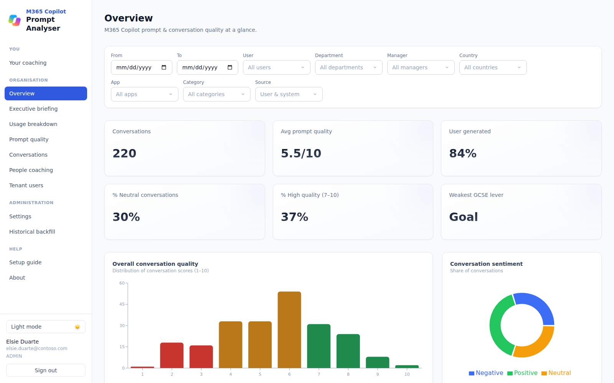
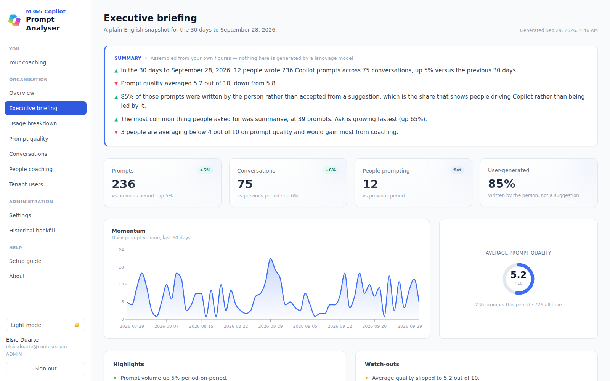
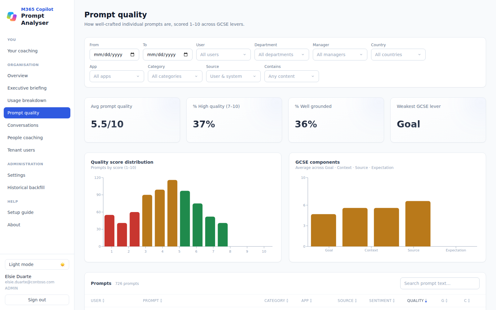
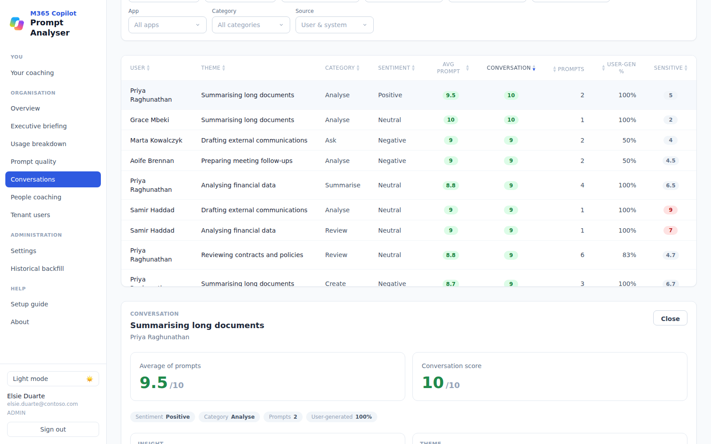
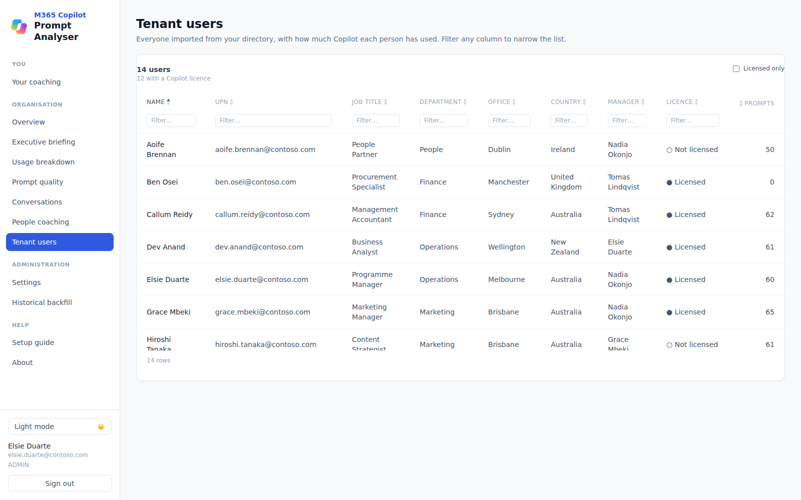
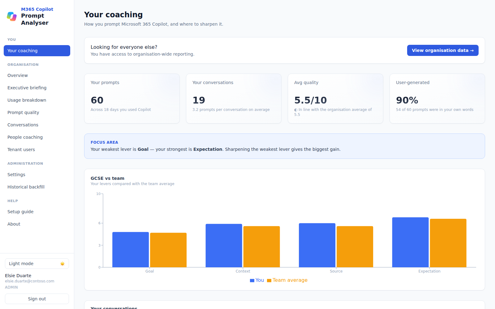
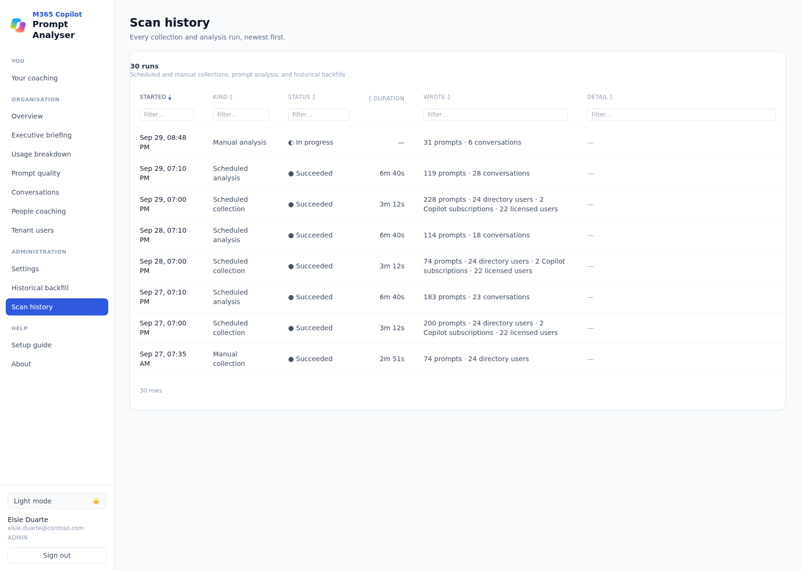
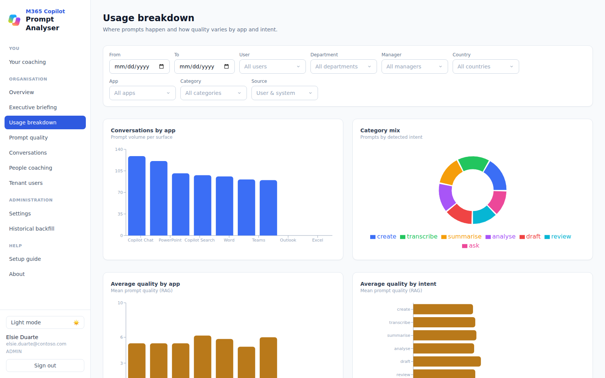
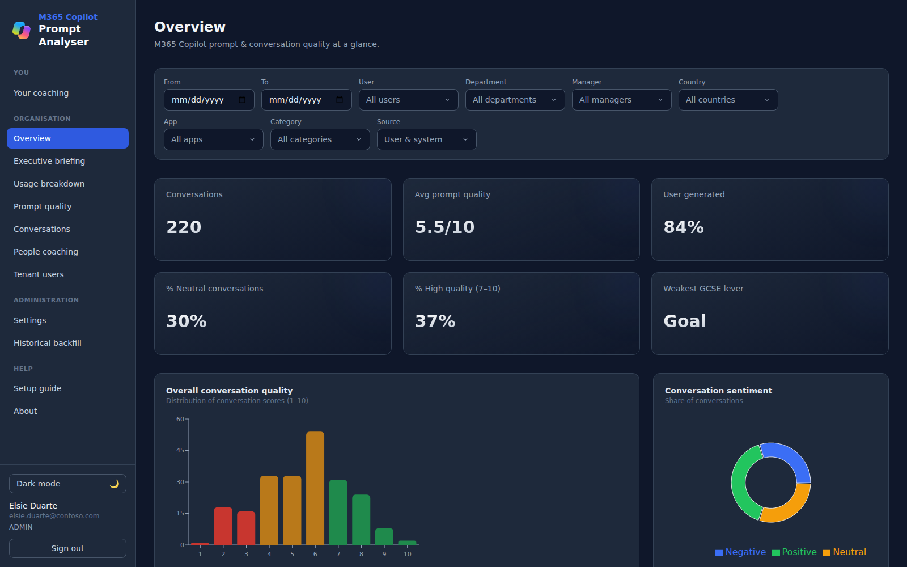

# M365 Copilot Prompt Analyser

Self-hosted prompt-quality reporting for **Microsoft 365 Copilot**. It ingests prompts from
Microsoft Graph, sends each conversation to Azure OpenAI for quality, GCSE, sentiment and
category scoring plus sensitive-information detection, stores the results in PostgreSQL, and
serves a web dashboard. A replacement for the Power Platform + Power BI version — no Power BI
licence, no Power Platform, and no data leaves your subscription. Runs anywhere with
`docker compose up`, or deploys to Azure Container Apps in one click.

[](https://portal.azure.com/#create/Microsoft.Template/uri/https%3A%2F%2Fraw.githubusercontent.com%2Floryanstrant%2FM365Copilot-Prompt-Analyser%2Fmain%2Finfra%2Fazuredeploy.json/createUIDefinitionUri/https%3A%2F%2Fraw.githubusercontent.com%2Floryanstrant%2FM365Copilot-Prompt-Analyser%2Fmain%2Finfra%2FcreateUiDefinition.json)

> Community project, MIT-licensed. Not covered by a Microsoft support agreement.
## Screenshots

These are desktop dashboards. They are built and checked at desktop widths — there
is no mobile layout, and none is planned.

### Overview
At-a-glance KPIs (conversations, average prompt quality, user-generated share,
sentiment, high-quality rate, weakest GCSE lever) plus the conversation-quality
distribution and sentiment mix.



### Executive briefing
The last 30 days against the 30 before, written out in sentences: volume and
people prompting, how quality moved, the share of prompts people wrote themselves,
what they asked for most, what their conversations were about, and the coaching
watch-outs. Every figure is SQL and every sentence is assembled from fixed
thresholds — **no language model writes any of it**, so it can be read out in front
of a customer without anyone checking whether a number was invented.



### Prompt quality
Per-prompt scoring (1–10) across the four GCSE levers, the quality distribution,
and a searchable, sortable table with per-prompt sentiment, source and the
name / sensitive-info / profanity governance signals.



### Conversations
Session-level themes, sentiment and both the **average-of-prompts** and holistic
**conversation** score. Selecting a conversation opens the full narrative
(insight, theme, suggested improvement, suggested starter prompt) and the ordered
prompt thread with each prompt's scores.



### Tenant users
Everyone imported from your directory, with their job title, department, office,
country, manager by **name** rather than object ID, whether they hold a Copilot
licence, and how many prompts they have actually written. Any column can be
filtered, so "who holds a licence and has never used it" is a two-click question.



### Your coaching
Each person's own view: their prompts, conversations, average quality against the
organisation's, and how much of what they send is their own words — each with a
subtitle that says what the number means rather than repeating its label. Plus a
focus-area callout, **How you compare** — their GCSE levers against their own team
and the whole organisation, out of 10 — a daily timeline of their prompts with a
seven-day trailing average, and their own conversations.

A team average is only ever shown when the team holds at least five people other
than the viewer. Below that it is left out and the chart says so: with two people
in a team, the team average and your own figure give the other person's exact
number.



### Scan history
Every collection and analysis run, newest first — what kind it was, when it
started, how long it took, what it wrote, and whether it succeeded, with a failed
run showing its error. Status is a shape plus a word (● ◐ ○), never colour alone.



### Usage breakdown & dark mode
Per-app and per-intent volume and average quality, category mix, and GCSE-by-intent.
Every page supports a light and dark theme.




Every screenshot here exists in both themes; see
[`docs/screenshots/README.md`](docs/screenshots/README.md) for how they are produced.


## Deploy to Azure (one click)

The button provisions everything into a resource group of your choice: a PostgreSQL
flexible server, a Container Apps environment, and the **api** + **worker** container
apps (pulled as prebuilt public images from GitHub Container Registry). You only enter
an **admin password** — the database password and encryption keys are generated for
you. When the deployment finishes, open the `dashboardUrl` output, sign in, and
complete the in-app **Settings** to connect Microsoft Graph and Azure OpenAI.

To deploy from source with `azd` instead, see [`docs/deploy.md`](docs/deploy.md).

## After it's deployed

**1. Open the dashboard.** In the portal, go to your resource group → open the deployment (or
Deployments → the `Microsoft.Template` run) → **Outputs** → copy **`dashboardUrl`**. That is your app.
It's served by the **`…-api-…`** Container App (the `…-worker-…` one has no web UI — it just runs
ingestion + analysis in the background). You can also get the URL from the api Container App's
**Overview → Application Url**.

**2. Sign in.** Username is what you set as **admin username** (default `admin`); password is the
**admin password** you chose at deploy time.

**3. Connect Microsoft Graph and Azure OpenAI.** Go to **Settings**. The first-run wizard walks you
through creating an Entra **app registration** with the two application permissions
(`AiEnterpriseInteraction.Read.All`, `Directory.Read.All`, admin-consented) and a client secret —
or reuse the Usage Reporter's app registration, which already has them. Paste **Tenant ID**,
**Client ID**, **Client secret**, then **Test connection**. Under **Azure OpenAI**, paste your
**endpoint** (just `https://<resource>.openai.azure.com` — the `/openai/v1` path is added for
you), **deployment** (default `gpt-5.4-mini`) and **key**, then **Test Azure OpenAI**.

**4. Load and analyse data.** Select **Run now** for the last 24 hours, or open **Settings →
Historical backfill** to pull history (default 30 days). Ingest automatically runs the analysis
stage; you can also trigger **Run analysis** from Settings. The **Data status** card shows
Prompts / Conversations; the **Backfill** page has a run history table with per-run stats.

> **First run needs licensed users.** The backfill iterates your Copilot-**licensed** users, so run
> an ingest (**Refresh now**) at least once first — that populates the licensed-user snapshot. A
> backfill that "completes instantly with no data" almost always means **zero Copilot-licensed
> users** were found: check **Test connection**'s *Copilot-licensed users* count, and if it's 0 the
> configured **Copilot SKU ID** doesn't match any assigned licences (default is Microsoft 365
> Copilot, `639dec6b-bb19-468b-871c-c5c441c4b0cb`).

### Enabling Entra ID single sign-on (optional)

By default the dashboard is protected by the single admin password. You can additionally let
colleagues sign in with their **work account**, and name an Entra group whose members
**administer** the app, so administration no longer means passing one password around. The local
admin account keeps working either way — it is the break-glass account, and it is the one you use
to set the admin group in the first place.

Sign-in is performed by the app itself, so it works the same wherever you run it: Azure, Docker
on a NAS, Kubernetes, anywhere. There is nothing to configure on the hosting platform.

It reuses the **same app registration** you already entered for collecting data, so there is no
second set of credentials to manage:

1. Sign in as the admin and open **Settings**.
2. Copy the **redirect URI** shown there.
3. In the Entra portal, open your app registration → **Authentication → Add a platform → Web**,
   and paste that redirect URI.
4. Optionally set a **report access group** in Settings to restrict who can view the dashboard. If
   you do, add a **groups** claim under **Token configuration** on the app registration.
5. Optionally set an **admin group** in Settings. Its members get administrator rights when they
   sign in with Entra. Left blank, **nobody** gets admin by single sign-on — unlike the
   organisation-view group below, this one fails closed, because administration has always been an
   explicit grant and an upgrade must not hand it to everyone who can sign in.

Group membership for both gates is re-read per request rather than stamped into the sign-in token,
so removing someone takes effect within minutes instead of at their next sign-in. No extra Graph
permission is needed: the app-only credential you already entered can answer the membership check.
The sidebar shows whoever is signed in by **display name**, with their UPN beneath it.

The sign-in page then shows a **"Sign in with Microsoft"** button.

> **Behind a reverse proxy?** The app works out its own public address from the request. If your
> proxy doesn't pass the standard forwarded headers, set `PUBLIC_BASE_URL` (for example
> `https://prompts.contoso.com`) so the redirect URI is correct.

Full details: [`docs/deploy.md`](docs/deploy.md#entra-single-sign-on-optional).

### Your coaching vs. the organisation view

Anyone signing in with their work account lands on **Your coaching** — their own prompts,
conversations, quality score and GCSE levers. That view is derived entirely from the signed-in
identity in the token: there is no user parameter anywhere in it, so nobody can read someone else's
coaching by editing a URL.

The organisation-wide pages (overview, usage breakdown, prompt quality, conversations, and
the **People coaching** picker) are gated separately by an **Organisation view group ID** in
**Settings**:

- **Leave it blank** and the organisation view stays open to every signed-in user — which is how the
  app behaved before personal coaching existed, so upgrading never locks existing viewers out.
- **Set it to an Entra security group** and only its members (plus the password admin, who always
  has access) see organisation-wide data. Everyone else keeps their own coaching view and sees the
  organisation switch shown locked, with a note to ask their administrator.

This is deliberately **not** the same as the **Report access group ID** above it: that one decides
who can open the report at all, while this one decides who can look beyond themselves. Membership is
re-checked on every request rather than stamped into the sign-in token, so removing someone from the
group takes effect in minutes instead of at their next sign-in.

**Evaluating without Entra?** Loading demo data binds the local admin account to one of the seeded
directory people, so **Your coaching** and the rest of the personal pages work without any
single sign-on at all. The binding is written only by an explicit demo seed, is cleared when you
clear demo data, and is dropped automatically the first time a real collection succeeds — so a
fictional person's prompts can never end up presented as yours beside live tenant figures.

### Where to find run history, logs, and errors

- **In the app:** **Scan history** (every collection and analysis run, newest first, with what it
  wrote and why it failed), **Settings → Data status** (last run + counts) and **Historical
  backfill** (per-run history with prompts/lookback/status).
- **Container logs (the real detail):** manual **Refresh now**, **Backfill** and **Run analysis**
  run inside the **`…-api-…`** Container App, so their logs live there — open it → **Monitoring →
  Log stream** (live), or **Logs** to query `ContainerAppConsoleLogs_CL`. The scheduled background
  ingest + analysis runs in the **`…-worker-…`** Container App — check its log stream for
  scheduled-run errors.
- **Analysis errors** (e.g. Azure OpenAI throttling or a bad deployment name) surface in the
  analysis run's stats and the api/worker log stream. Confirm the deployment + key with **Test Azure
  OpenAI** on the Settings page.

This is a sibling of
[`M365Copilot-Usage-Reporter`](https://github.com/loryanstrant/M365Copilot-Usage-Reporter)
and [`AgentQualityReporter`](https://github.com/loryanstrant/AgentQualityReporter)
and shares their scaffold (Python/FastAPI engine, Postgres, React dashboard,
one-click Azure deploy). The one addition here is an **LLM analysis stage**.

## What it does

A desktop web dashboard — there is no mobile layout.

- **Overview** — KPIs (conversations, average prompt quality, user-generated share,
  sentiment, high-quality rate, weakest GCSE lever) plus the conversation-quality distribution.
- **Executive briefing** — this period against the last, in plain English: volume, people
  prompting, average quality out of 10, the share of prompts written by hand rather than
  accepted from a suggestion, the most common request types with their movement, the themes
  running through conversations, and the coaching watch-outs. **Deterministic** — the figures
  are SQL and the sentences are assembled from fixed thresholds, so the briefing cannot invent
  a number even though the app has Azure OpenAI configured.
- **Usage breakdown** — volume and quality split by app, department, office and category.
- **Prompt quality** — GCSE lever scores (Goal, Context, Source, Expectation), quality trends,
  and the prompts most in need of help.
- **Conversations** — drill into any conversation, see its per-prompt scores and governance flags.
- **Tenant users** — the imported directory joined to the usage: licence held or not (shown as
  ● / ○ plus the word), prompts written, and manager resolved to a name. People with no activity
  are listed rather than filtered out, because an unused licence is the row worth finding.
- **Your coaching** — every signed-in colleague gets their own coaching view (their prompts,
  quality against the organisation's, and GCSE levers), with the organisation-wide reports gated
  separately. See [Your coaching vs. the organisation view](#your-coaching-vs-the-organisation-view).
- **How you compare** — your levers against **your team** and **your organisation**, out of 10,
  over one named period. Your team is your department, falling back to the people who share your
  manager. It is withheld entirely when that group holds fewer than five people besides you, and
  the chart says which applies — "too small to show" or "we don't know which team you're in".
  Aggregates only: no individual's figures are ever exposed.
- **Your prompts over time** — a daily timeline with a seven-day trailing average, filling days
  with no activity rather than skipping them, because a fortnight of silence is usually the
  signal worth seeing.
- **Scan history (admin)** — every collection and analysis run with its kind, duration, what it
  wrote and whether it succeeded; a failed run shows its error. This is what `job_runs` has
  recorded since the first release and nothing ever displayed.
- **People coaching (organisation)** — pick anyone and see the coaching view they would get.
- **Settings (admin)** — Graph and Azure OpenAI config (secrets write-only, Fernet-encrypted),
  a guided app-registration wizard, test connection, run now, demo data, and a resumable
  **backfill** with live progress.
- **Entra single sign-on (optional)** — colleagues view the report with their work account,
  optionally gated to an Entra security group. Named people can also be made **administrators**
  by Entra group, so administration does not mean sharing one password; the sidebar shows who is
  signed in by display name.
- **Copilot licences are detected, not configured.** Anyone holding a SKU that includes the
  *Microsoft Copilot with Graph-grounded chat* service plan counts — which covers Microsoft 365
  Copilot (both SKUs), Microsoft 365 E7, Copilot for Sales and any new Copilot subscription,
  with nothing to enter. A bundle assigned with Copilot switched off correctly does not count.
- Global filters, CSV export, and a **light/dark** theme throughout. Status is always shown as a
  shape and a word (● ◐ ○), never by colour alone.

### How the scoring works

- **Model-agnostic.** The Azure OpenAI **deployment name** is configuration, not code. Default is
  **`gpt-5.4-mini`**; switch to a larger model for higher accuracy or a smaller one for lower cost
  in **Settings**, with no redeploy.
- **One call per conversation.** Quality scoring and sensitivity detection are merged into a single
  call per conversation, turning `1 + N` model calls into `1`. Set the analysis mode to `split` to
  run them separately (e.g. to route sensitivity to a cheaper model or an external PII service).
- **Structured Outputs.** Responses are constrained by a JSON schema, so parsing never relies on the
  model avoiding markdown.
- **Incremental and idempotent.** Only unanalysed prompts are picked up, and each conversation is
  analysed as a unit so its aggregate scores stay consistent.

## Prerequisites & permissions

- A **Global Administrator** (or Privileged Role Administrator plus Application Administrator) to
  create the app registration and grant admin consent.
- Microsoft 365 Copilot licences assigned in the tenant.
- An **Azure OpenAI** deployment — endpoint, key and deployment name. The analysis stage cannot run
  without it.
- PowerShell 7 with the Microsoft Graph SDK, if you'd rather script the registration.

The app registration needs these **application** permissions (not delegated), both admin-consented.
If you already run the M365 Copilot Usage Reporter, you can reuse its app registration as-is.

| Permission | Why |
| --- | --- |
| `AiEnterpriseInteraction.Read.All` | Reads Copilot enterprise interaction history — the prompts that get analysed. |
| `Directory.Read.All` | Resolves users and departments so prompt quality can be grouped and filtered. |

The in-app **Setup guide** page and the Settings wizard both carry a one-shot PowerShell script that
creates the registration, grants consent and prints the three values you need:

```powershell
# Run in PowerShell 7 with the Microsoft Graph SDK.
# Requires a Global Administrator (or Privileged Role + Application admin).
Install-Module Microsoft.Graph -Scope CurrentUser -Force  # first time only
Connect-MgGraph -Scopes "Application.ReadWrite.All","AppRoleAssignment.ReadWrite.All"

$graphSp = Get-MgServicePrincipal -Filter "appId eq '00000003-0000-0000-c000-000000000000'"
$needed  = "AiEnterpriseInteraction.Read.All","Directory.Read.All"
$roles   = $graphSp.AppRoles | Where-Object { $needed -contains $_.Value }

$app = New-MgApplication -DisplayName "M365 Copilot Prompt Analyser" -RequiredResourceAccess @{
  ResourceAppId  = "00000003-0000-0000-c000-000000000000"
  ResourceAccess = @($roles | ForEach-Object { @{ Id = $_.Id; Type = "Role" } })
}
$sp = New-MgServicePrincipal -AppId $app.AppId

# Grant admin consent for both application permissions
foreach ($r in $roles) {
  New-MgServicePrincipalAppRoleAssignment -ServicePrincipalId $sp.Id `
    -PrincipalId $sp.Id -ResourceId $graphSp.Id -AppRoleId $r.Id | Out-Null
}

$secret = Add-MgApplicationPassword -ApplicationId $app.Id `
  -PasswordCredential @{ DisplayName = "prompt-analyser"; EndDateTime = (Get-Date).AddYears(1) }

Write-Host "Tenant ID:     $((Get-MgContext).TenantId)"
Write-Host "Client ID:     $($app.AppId)"
Write-Host "Client secret: $($secret.SecretText)"
```

## Quick start (local)

```powershell
# 1. Env file + a Fernet key
Copy-Item .env.example .env
python -c "from cryptography.fernet import Fernet; print(Fernet.generate_key().decode())"
# paste the printed value into FERNET_KEY in .env

# 2. Start the production stack (api + worker + postgres)
docker compose up -d
```

- **Dashboard + API:** http://localhost:8003
- **API + Swagger:** http://localhost:8003/docs
- **Health:** http://localhost:8003/health

This is the production stack: it runs prebuilt images with no bind mounts and no
auto-reload, and the API serves the built dashboard itself — so there is no separate
frontend container or web port. `docker compose up` pulls the published images; add
`--build` to build them locally instead.

Every solution in the suite owns a distinct port block, so all four can run side by
side without clashing:

| Solution | API / dashboard | Postgres |
|---|---|---|
| M365 Copilot Usage Reporter | 8000 | 5432 |
| M365 Copilot Cowork Reporter | 8001 | 5433 |
| Copilot Studio Agent Quality Reporter | 8002 | 5434 |
| **M365 Copilot Prompt Analyser** | **8003** | **5435** |

Override `API_PORT` / `DB_PORT` in `.env` to move them. Only the host side changes —
container-internal wiring is unaffected.

### Developing against it

For hot-reload while working on the code, layer the dev override on top. It builds
locally, bind-mounts the source, enables `uvicorn --reload` and runs the Vite dev
server:

```powershell
docker compose -f docker-compose.yml -f docker-compose.dev.yml up --build
```

The dev dashboard is then on http://localhost:5176 (`WEB_PORT`), with the API still
on 8003.

On first start an admin login is seeded from `ADMIN_USERNAME` / `ADMIN_PASSWORD` in `.env`
(defaults `admin` / `change-me` — change these).

## First-run checklist

1. `docker compose up` (or deploy to Azure).
2. Sign in with `ADMIN_USERNAME` / `ADMIN_PASSWORD` (seeded automatically on first start).
3. **Settings** → follow the guided wizard to create the app registration, then enter Tenant ID,
   Client ID and Client secret, and **Test connection**.
4. Under **Azure OpenAI**, enter endpoint, deployment and key, then **Test Azure OpenAI**.
5. **Run now** (pulls and analyses recent prompts) or start a **Historical backfill** from Settings
   for history.
6. Explore the dashboard.

Just evaluating? Skip steps 3–5 and use **Settings → Demo data → Load demo data** instead. That
seeds a small directory of people with departments, offices, countries and a reporting line, so the
slicers, the person picker and the **Tenant users** listing all work — and it binds your admin
account to one of them so the personal pages are reachable too.

## Data & privacy notes

- Prompt text is sent to **your own** Azure OpenAI deployment for scoring and is never sent to any
  third-party service. All data stays in your subscription.
- Conversation text is retained so you can drill into a conversation and see why it scored as it
  did. If that isn't acceptable in your tenant, restrict who can sign in using the report-access
  group.
- The Graph **client secret** and the Azure OpenAI **key** are encrypted at rest with a Fernet key
  and are write-only in the API: they can be set and replaced, never read back.
- Governance signals flag prompts that appear to contain names or sensitive information so you can
  coach people — they are not a substitute for Purview DLP.
- Demo data is clearly labelled as such in Settings, and is only ever created or removed by an
  explicit action.

## License

MIT. Community project — no Microsoft support agreement or SLA.
